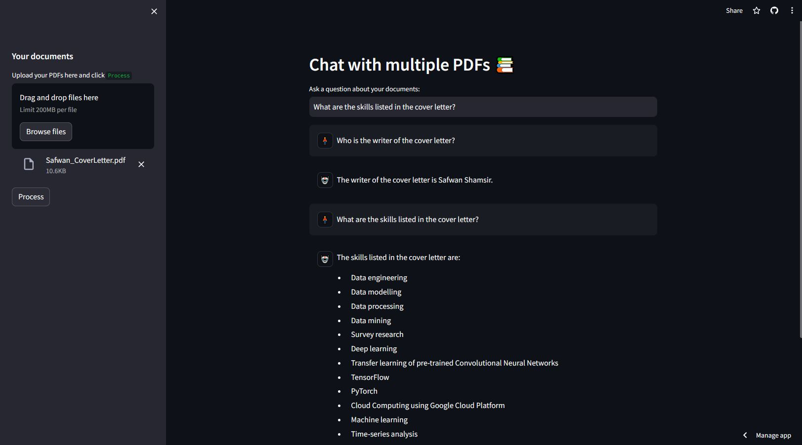

# PDF-Chatbot-using-LLM
Simple PDF Chatbot by using Langchain, OpenAI API, FAISS, and Streamlit. This chatbot is very useful to do skimming in literature.

## **User Interface**

## Built With

## Credits
Shout out to Alejandro AO from YouTube for the PDF Chatbot [tutorial](https://www.youtube.com/watch?v=dXxQ0LR-3Hg). Check out his github repositories by clicking this [link](https://github.com/alejandro-ao/ask-multiple-pdfs/tree/main). :smile: